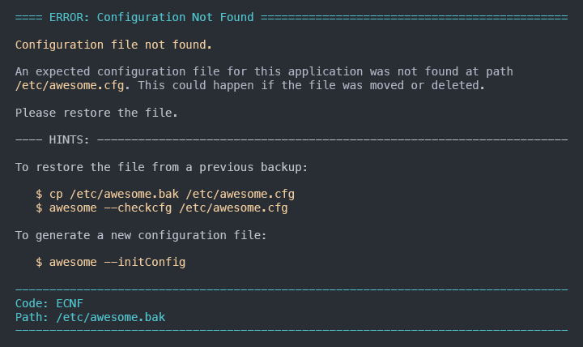
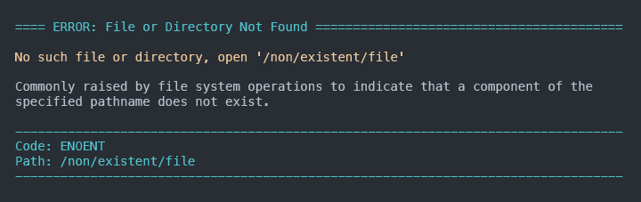

[![Stories in Ready][waffle-img]][waffle-url] [![bitHound Dependencies][bh-dep-img]][bh-dep-url] [![bitHound Code][bh-code-img]][bh-code-url] [![codecov][codecov-img]][codecov-url] [![Build Status][travis-img]][travis-url]

# SolidError

A simple javascript class to print meaningful errors, inspired by [elm][1]'s error verbosity.

![SolidError screenshot][2]

## Installation

Install SolidError using NPM:

  ```bash
  npm install --save solid-error
  ```

## What it's useful for

SolidError come in handy whenever you need to present **meaningful**, consistent errors to your users in a javascript console application.

It can be used to log custom errors and to wrap unexpected system errors, giving a coherent, customizable look to your errors throughout your program.

It accept external Error Definition files that will be automatically mapped to your custom errors to help you keep your code organized and it support multiple languages.

## How it works

At its core SolidError is an [Error][3] subclass so you can threat it as normal [Error][3] instance. You can log it, throw it, read its stack trace, the usual.

However, when converted to a string, SolidError will render an in-depth, formatted, error explanation to the console that follows the convention:

    ==== ERROR: <Human readable error name> ========================

    <The Error's message>

    <SolidError's error explanation>

    ---- HINTS: ----------------------------------------------------

    <SolidError's hints section>

    ----------------------------------------------------------------
    Code: <The Error's code>
    [Path: <The Error's file or directory path>]
    ----------------------------------------------------------------

### Examples

See: [Running the examples](examples/README.md)

### Basic Error

The most basic error you can create looks like this:

```javascript
import { SolidError, logError }

logError( new SolidError( 'Something went wrong.' ) )
```

Which will print:


### Creating a custom error

To provide your users with more informations regarding your error, create an _error definition_ to describe it.

Supply a short and a long explanation for the cause and help them resolve the issue by giving them some hints. Use markdown syntax to format and highlight your text.

Read [Using external Error Definitions](#using-external-error-definitions) to learn how to use _external definitions_.

```javascript
import { SolidError, logError } from 'solid-error'

// Create an error definition
// that describe the cause of error
const errProps = {
  code: 'ECNF',
  errno: -500,
  path: '/etc/awesome.cfg'
  name: 'ConfigurationNotFoundError',
  readableName: 'Configuration Not Found',
  message: 'Configuration file not found.',
  explain: 'An expected configuration file for this application was not found '
    + 'at path `/etc/awesome.cfg`. This could happen if the file was moved or '
    + 'deleted.\n\nPlease restore the file.',
  hints: 'To restore the file from a previous backup:\n\n'
    + '```bash\n'
    + '$ cp /etc/awesome.bak /etc/awesome.cfg\n'
    + '$ awesome --checkcfg /etc/awesome.cfg\n'
    + '```\n\n'
    + 'To generate a new configuration file:\n\n'
    + '```bash\n'
    + '$ awesome --initConfig'
    + '```'
}

const err = new SolidError( errProps.describe, errProps )
logError( err )
```

Once logged, your solid error will look like:



### Wrapping errors

Sometimes you may need to throw errors that are unknown and unexpected. Wrapping them in a SolidError will automatically format the error for you giving your users a consistent experience.

```javascript
import fs from 'fs'
import { SolidError, logError } from 'solid-error'

fs.readFile( '/non/existent/file', ( err, data ) => {
  if ( err ) {
    const readErr = new SolidError( err )
    logError( readErr )
  }
})
```



### Using external Error Definitions

Defining Error Definitions manually in code can be a tedious task. Besides, you may have custom errors already defined in your code.

```javascript
class ConfigurationNotFoundError extends Error {
  constructor( ...args ) {
    super( args )
    this.name = 'ConfigurationNotFoundError'
    this.message = 'Configuration file not found.'
  }
}
```

To keep your code clean and organized you can define **external** error definitions that will map one-to-one with your error's name.

Create a directory to host your error definitions (SolidError support multiple languages, so by default all definitions should be at least provided for the english language):

  ```bash
  mkdir -p ./errdef/en
  ```

Describe your error in a `ConfigurationNotFoundError.yaml` file, and save it under `./errdef/en/`

  ```yaml
  code : ECNF
  errno : -500
  name : ConfigurationNotFoundError
  readablName : Configuration Not Found
  path : /etc/awesome.cfg
  explain : >
    An expected configuration file for this application was not found
    at path `/etc/awesome.cfg`. This could happen if the file was moved or
    deleted.

    Please restore the file.
  hints : >
    To restore the file from a previous backup:

      $ cp /etc/awesome.bak /etc/awesome.cfg
      $ awesome --checkcfg /etc/awesome.cfg

    To generate a new configuration file:

      $ awesome --initConfig
  ```

Add the error definitions directory to the options:

```javascript
import solidErr, { SolidError, logError } from 'solid-error'

solidErr.setOptions({
  includes: [ './errdef' ]
})
```

Now, when your custom error gets logged,

```javascript
try {
  getConfig() // throws a ConfigurationNotFoundError
}
catch ( configErr ) {
  logError( new SolidError( configErr ) )
}
```

Solid Error will print its definition:


### Customizing output appearance

Use `setStyles` to define SolidError's output appearance.

```javascript
import solidErr, { SolidError, logError } from 'solid-error'

solidError.setStyles({
  marginRight: 0,        // set margin right to 0 (default: 2)
  columns: 55,           // width reduced to 55 columns
  wordwrap: true,        // enable wordwrap (default)
  headerColor: 'red',    // set header color to red
  headerStyle: '—',      // set header style to em-dash
  headerTitle: 'OOPS',   // change header title prefix
  messageColor: 'cyan',  // set description message to cyan
  hintsColor: 'green',   // set the example color to green
  hintsStyle: '—',       // change example style to em-dash
  hintsTitle: 'HINTS',   // change example title prefix
  footer: 'red',         // set footer color to red
  footerStyle: '—',      // set footer style to em-dash
})

const errProps = {
  code: 'ESTYL',
  errno: -1,
  name: 'ExampleStyleError',
  readableName: 'Example Style Error',
  message: 'Just an example error to show appeareance customization',
  explain: 'This error was custom created to test **SolidError** style '
    + 'customization.\n\nHeader and footer should be **red** '
    + 'while the error description should be **cyan**. Also, section divider\'s'
    + ' styles should look different.',
  example: 'Example section should be called _`HINTS`_ now.'
}

logError( new SolidError( errProps.describe, errProps ) )
```

Your solid error will now look something like:


#### Custom Renderers

You can opt-out from the default style by providing a **custom renderer**.

```javascript
import MyCustomRender from './myRenderer'
import solidErr from 'solid-error'

solidErr.setOptions({
  renderer: new MyCustomRender()
})
```

Take a look at [SolidRender](src/lib/solidrender), the default renderer, to learn how to write your custom renderer.

### Using custom languages

You can easly support internazionalization with multiple language translations.
In addition to translate your custom errors, you can override the default error definitions by naming your definition like a [class error][4] or a [syserror code][4].

Read [Using external Error Definitions](#using-external-error-definitions) to learn how to setup external definitions.

To override the default `ENOENT` SystemError definition, for example, create a file named `ENOENT.yaml` in your target language directory. To override `ENOENT` for the Italian language, save you file to `./errdef/it/ENOENT.yaml`

Define your translated error:

  ```yaml
  code  : ENOENT
  errno : -2
  name  : FileOrDirectoryNotFoundError
  readableName : File o Directory Non Trovata
  message : File o directory non trovata al percorso indicato.
  explain : >
  Tipicamente invocato da operazioni che coinvolgono il file system per
  indicare che un componente al percorso specificato non esiste.
  ```

Then simply change the language from the options and add your custom error definitions directory to the additional directories:

```javascript
import fs from 'fs'
import path from 'path'
import solidErr, { SolidError, logError } from 'solid-error'

// Path that contains your Error Definitions files
const customErrPath = path.join( __dirname, './definitions' )

solidErr.setOptions({
  lang: 'it',                   // set the language to 'it'
  includes: [ customErrPath ]
})

try {
  // raise ENOENT (file or directory not found ) error
  fs.readFileSync( '/non/existent/file' )
}
catch( readErr ) {
  // log the translated error.
  logError( new SolidError( readErr ) )
}
```

Now, when a `ENOENT` system error gets logged, you will get the transalted version of the error:


## HISTORY

Review the [change log](CHANGELOG.md), if you're into that stuff! 🕵

## CREDITS

SolidError is written and mantained by Roberto Mauro.

## LICENSE

SolidError is releases under the MIT License. For more information review the [LICENSE](LICENSE) file.


[1]: http://elm-lang.org "Open Elm Lang Official Site"
[2]: screenshots/screenshot.png "SolidError Example Screenshot"
[3]: https://nodejs.org/api/errors.html#errors_class_error "View Node's Error documentation"
[4]: https://nodejs.org/api/errors.html "View Node Error Documentation."

[waffle-img]: https://badge.waffle.io/erremauro/solid-error.png?label=ready&title=Ready
[waffle-url]: https://waffle.io/erremauro/solid-error
[bh-dep-img]: https://www.bithound.io/github/erremauro/solid-error/badges/dependencies.svg
[bh-dep-url]: https://www.bithound.io/github/erremauro/solid-error/v0.3.0-beta/dependencies/npm
[bh-code-img]: https://www.bithound.io/github/erremauro/solid-error/badges/code.svg
[bh-code-url]: https://www.bithound.io/github/erremauro/solid-error
[codecov-img]: https://codecov.io/gh/erremauro/solid-error/branch/master/graph/badge.svg
[codecov-url]: https://codecov.io/gh/erremauro/solid-error
[travis-img]: https://travis-ci.org/erremauro/solid-error.svg?branch=master
[travis-url]: https://travis-ci.org/erremauro/solid-error
